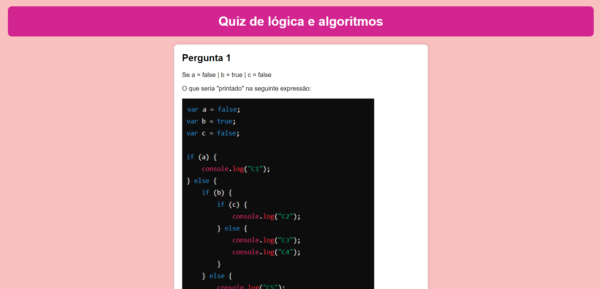
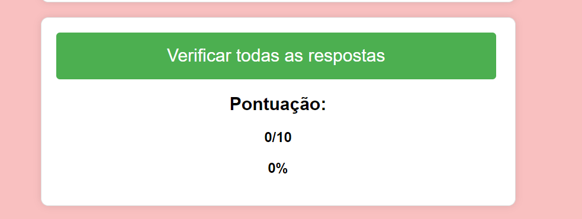

# Quiz de lógica e algoritmos

Este é uam página web que apresenta um quiz de 10 perguntas sobre lógica e algoritmos. Cada pergunta apresenta uma questão e três opções de resposta. O usuário pode selecionar uma opção de resposta para cada pergunta e, ao final, verificar suas respostas e obter uma pontuação. O página é desenvolvida em HTML, CSS e JavaScript, e inclui recursos como imagens e estilização para melhorar a experiência do usuário.

## Sobre o projeto

O projeto foi criado com o intuito de praticar o que eu aprendi ao longo do curso de algoritimos e lógica de programação e também é um projeto de PDI.

### Instalação

1. Clone o repositório:

   git clone https://github.com/pollymsr/prova_algoritimos.git

2. Navegue até o diretório do projeto:

   cd prova_algoritimos

3. Abra o arquivo index.html em seu navegador para iniciar o quiz.

### Tecnologias Utilizadas

HTML 
CSS  
JavaScript  

### Contribuição

Se você deseja contribuir com este projeto, siga os passos abaixo:

1. Faça um fork do projeto.
2. Crie uma branch para sua feature (git checkout -b feature/nova-feature).
3. Commit suas alterações (git commit -m 'Adiciona nova feature').
4. Faça um push para a branch (git push origin feature/nova-feature).
5. Abra um Pull Request.

### Fotos do projeto

